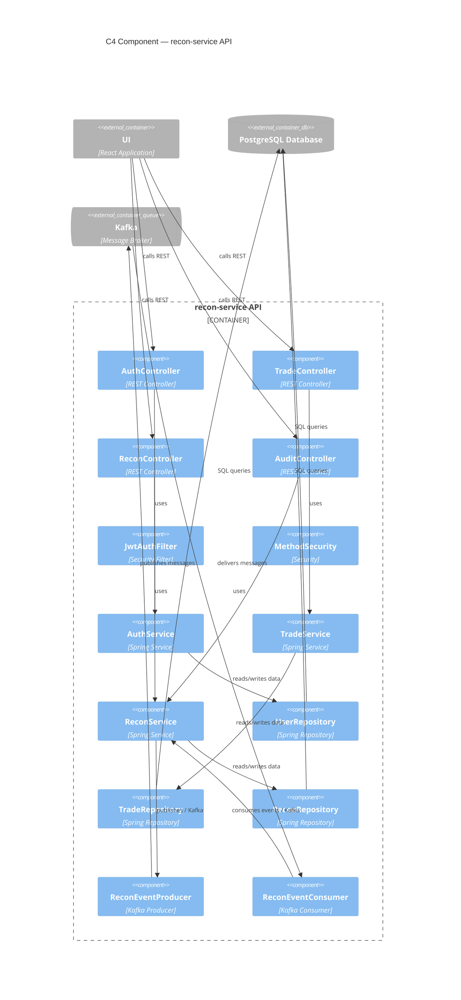

```mermaid
C4Component

title C4 Component — recon-service API

Container_Ext(ui, "UI", "React Application")

ContainerDb_Ext(postgres, "PostgreSQL Database")

ContainerQueue_Ext(kafka, "Kafka", "Message Broker")


Container_Boundary(api, "recon-service API") {


Component(authController, "AuthController", "REST Controller")
Component(tradeController, "TradeController", "REST Controller")
Component(reconController, "ReconController", "REST Controller")
Component(auditController, "AuditController", "REST Controller")


Component(jwtFilter, "JwtAuthFilter", "Security Filter")
Component(methodSecurity, "MethodSecurity", "Security")


Component(authService, "AuthService", "Spring Service")
Component(tradeService, "TradeService", "Spring Service")
Component(reconService, "ReconService", "Spring Service")


Component(userRepo, "UserRepository", "Spring Repository")
Component(tradeRepo, "TradeRepository", "Spring Repository")
Component(reconRepo, "ReconRepository", "Spring Repository")


Component(eventProducer, "ReconEventProducer", "Kafka Producer")
Component(eventConsumer, "ReconEventConsumer", "Kafka Consumer")

}


Rel(ui, authController, "calls REST")
Rel(ui, tradeController, "calls REST")
Rel(ui, reconController, "calls REST")
Rel(ui, auditController, "calls REST")


Rel(authController, authService, "uses")
Rel(tradeController, tradeService, "uses")
Rel(reconController, reconService, "uses")
Rel(auditController, reconService, "uses")


Rel(authService, userRepo, "reads/writes data")
Rel(tradeService, tradeRepo, "reads/writes data")
Rel(reconService, reconRepo, "reads/writes data")


Rel(userRepo, postgres, "SQL queries")
Rel(tradeRepo, postgres, "SQL queries")
Rel(reconRepo, postgres, "SQL queries")


Rel(reconService, eventProducer, "publishes / Kafka")
Rel(eventConsumer, reconService, "consumes events / Kafka")


Rel(eventProducer, kafka, "publishes messages")
Rel(kafka, eventConsumer, "delivers messages")

```